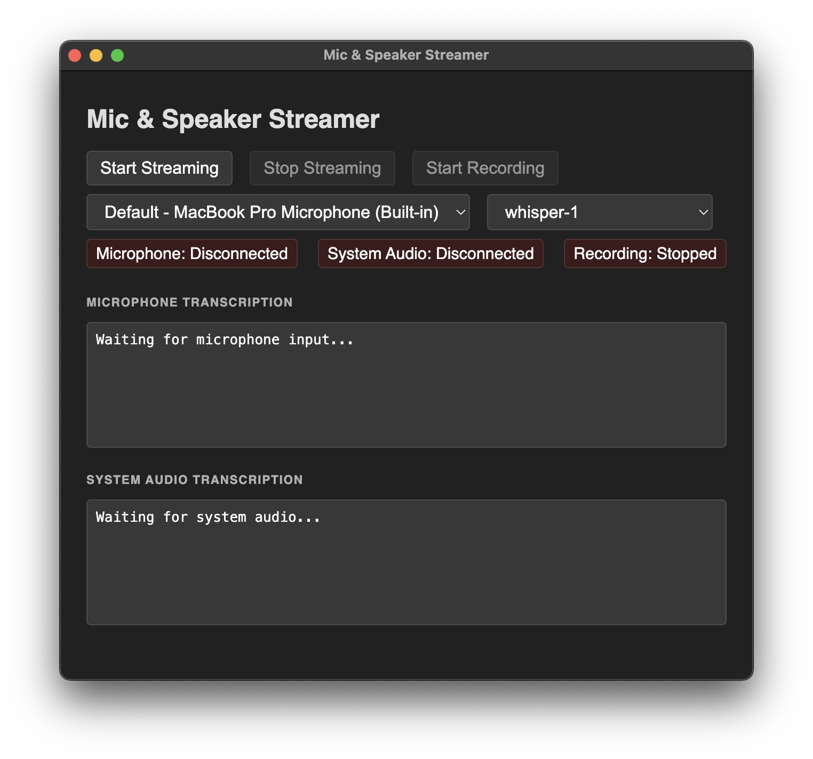
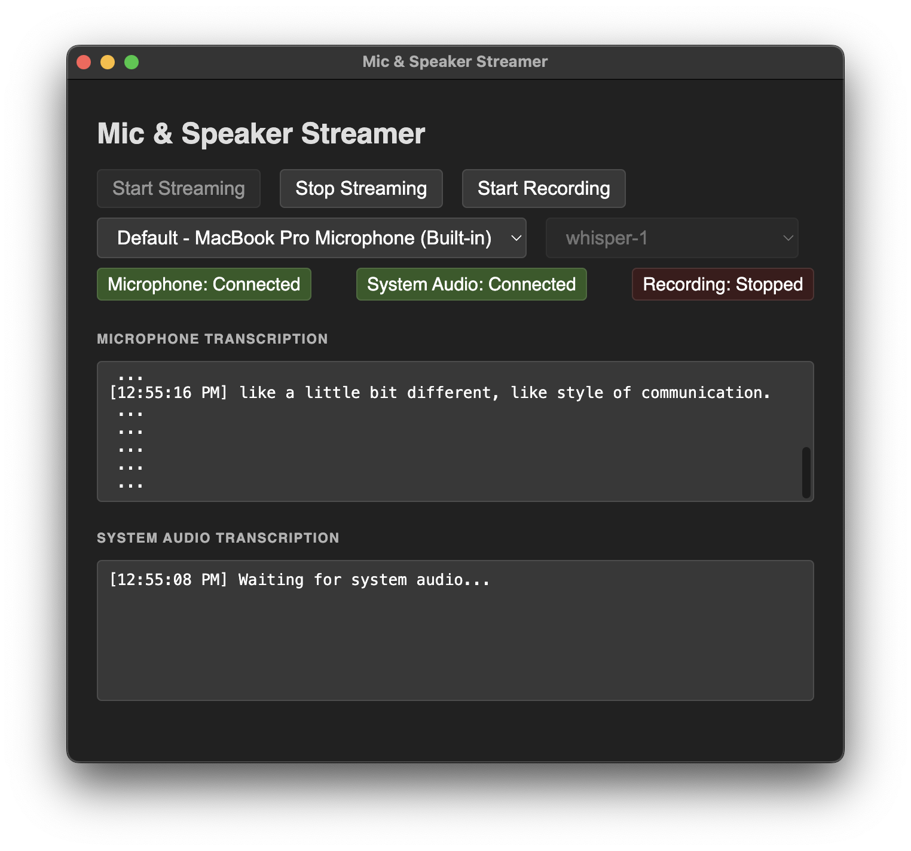

# Meet Pilot - Copiloto de Reuniões com IA

Um copiloto inteligente para reuniões que oferece coaching em tempo real durante chamadas de vendas e apresentações. O aplicativo captura áudio simultaneamente do microfone e do sistema, transcreve em tempo real e fornece sugestões contextuais baseadas em IA para melhorar sua performance.




## 🚀 Funcionalidades

### 🎯 **Core Features**
- **Transcrição em Tempo Real**: Stream de microfone e áudio do sistema para OpenAI Realtime API
- **Captura de Áudio Dual**: Captura simultânea de microfone e áudio de saída do sistema
- **Coaching com IA**: Sugestões contextuais em tempo real baseadas na conversa
- **Múltiplos Modelos**: Suporte a Whisper-1, GPT-4o Transcribe, GPT-4o Mini

### 📚 **Sistema de Playbook (Opcional)**
- **Base de Conhecimento**: Upload de PDFs, DOCX e TXT com material de vendas
- **Categorização Automática**: Organiza automaticamente em Objeções, Scripts, Casos de Sucesso e Perguntas
- **Busca Inteligente**: Encontra conteúdo relevante baseado no contexto da conversa
- **Sugestões Personalizadas**: IA usa o material carregado para sugestões mais específicas

### 🎨 **Interface Moderna**
- **Design Dark Theme**: Cores roxo neon, bordas arredondadas, animações suaves
- **Layout Responsivo**: Painéis organizados para controle, transcrição e coaching
- **Feedback Visual**: Status em tempo real e animações de entrada/saída

### 🎙️ **Gravação e Export**
- **Gravação WAV**: Grava áudio combinado de microfone + sistema
- **Export Automático**: Arquivos WAV com timestamp para revisão posterior

## 📋 Pré-requisitos

- Node.js (v16 ou superior)
- Chave da OpenAI com acesso à Realtime API
- Microfone e dispositivos de áudio
- Sistema operacional: Windows, macOS ou Linux

## 🛠️ Instalação

1. **Clone o repositório:**
   ```bash
   git clone https://github.com/lucastravagin/meet-pilot.git
   cd meet-pilot
   ```

2. **Instale as dependências:**
   ```bash
   npm install
   ```

3. **Configure as variáveis de ambiente:**
   ```bash
   cp .env.example .env
   ```
   
   Edite o arquivo `.env`:
   ```env
   # OBRIGATÓRIO: Chave da OpenAI
   OPENAI_KEY=sua_chave_openai_aqui
   
   # OPCIONAL: Sistema de Playbook
   PLAYBOOK_ENABLED=true
   PLAYBOOK_MAX_SIZE=10MB
   PLAYBOOK_TYPES=pdf,docx,txt
   ```

## 🚀 Como Usar

1. **Inicie a aplicação:**
   ```bash
   npm start
   ```

2. **Configure o sistema:**
   - Selecione seu microfone
   - Escolha o modelo de IA
   - (Opcional) Faça upload de material na Base de Conhecimento

3. **Inicie uma sessão:**
   - Clique em "Iniciar Sessão"
   - Permita acesso ao microfone
   - Selecione a janela/aplicação para capturar áudio do sistema (ex: Zoom, Teams)

4. **Receba coaching em tempo real:**
   - Suas falas aparecem em "Sua Voz"
   - Áudio da reunião aparece em "Áudio da Reunião" 
   - Sugestões de coaching aparecem no painel "Coach de IA"

## ⚙️ Configuração do Playbook

### 📁 **Upload de Documentos**
O sistema aceita:
- **PDF**: Material de vendas, case studies, documentação
- **DOCX**: Scripts, templates, propostas
- **TXT**: Listas de objeções, FAQs, argumentários

### 🏷️ **Categorização Automática**
- **🚫 Objeções**: Argumentos contra resistências comuns
- **📝 Scripts**: Roteiros de apresentação e fechamento
- **📊 Casos**: Cases de sucesso e estudos de ROI
- **❓ Perguntas**: Perguntas estratégicas para descoberta

### 🔍 **Como Funciona**
1. Faça upload dos seus materiais
2. O sistema categoriza automaticamente o conteúdo
3. Durante a reunião, a IA busca informações relevantes
4. Sugestões incluem trechos específicos do seu material

## 🎯 Tipos de Sugestões

### 💡 **Oportunidade**
"Cliente mencionou eficiência → Mostre caso Empresa X: 40% redução"

### ⚠️ **Objeção**
"Preço alto detectado → Use argumentário ROI página 3 do playbook"

### 🎯 **Engajamento**
"Silêncio longo → Pergunte: 'Como vocês lidam com isso hoje?'"

### → **Próximo Passo**
"Interesse confirmado → Agende demo técnica esta semana"

## 🔧 Configurações Avançadas

### **Variáveis de Ambiente**
```env
# Sistema de Playbook
PLAYBOOK_ENABLED=true|false          # Ativa/desativa o sistema
PLAYBOOK_PATH=./playbooks            # Pasta para armazenar arquivos
PLAYBOOK_MAX_SIZE=10MB               # Tamanho máximo de arquivo
PLAYBOOK_TYPES=pdf,docx,txt          # Tipos permitidos

# Exemplos de configuração
PLAYBOOK_ENABLED=false               # Desabilita o playbook
PLAYBOOK_MAX_SIZE=20MB               # Permite arquivos maiores
PLAYBOOK_TYPES=pdf,txt               # Apenas PDF e TXT
```

### **Controles de Teclado** (em desenvolvimento)
- `Ctrl+Shift+C`: Copiar última sugestão
- `Ctrl+Shift+D`: Dispensar sugestões
- `Ctrl+Shift+M`: Mute/unmute

## 🛠️ Desenvolvimento

### **Arquitetura**
- **Main Process** (`main.js`): Processo principal do Electron
- **Renderer Process** (`renderer.js`): Interface e lógica de negócio
- **Preload Script** (`preload.js`): Ponte segura entre processos

### **Classes Principais**
- **AICoach**: Análise de conversa e geração de sugestões
- **PlaybookManager**: Gerenciamento da base de conhecimento
- **Session**: Conexões WebRTC com OpenAI
- **WavRecorder**: Gravação e export de áudio

### **Dependências**
```json
{
  "electron": "35.0.0",
  "dotenv": "^17.2.0",
  "electron-audio-loopback": "^1.0.5",
  "pdf-parse": "^1.1.1",
  "mammoth": "^1.6.0",
  "fuse.js": "^7.0.0"
}
```

## 🔍 Solução de Problemas

### **Áudio não detectado**
- Verifique permissões de microfone
- No macOS: Permissões de Sistema > Segurança > Microfone

### **Playbook não aparece**
- Verifique se `PLAYBOOK_ENABLED=true` no .env
- Reinicie a aplicação após alterar .env

### **Erros da API**
- Confirme que sua chave OpenAI tem acesso à Realtime API
- Verifique conexão com internet

### **Áudio do sistema não captura**
- No Windows: Selecione "Compartilhar som do sistema" ao escolher a tela
- Certifique-se de que a aplicação alvo (Zoom/Teams) está rodando

## 📄 Licença

Este projeto é fornecido como está para fins educacionais e de desenvolvimento. Use à vontade!

## 👨‍💻 Autor

**Lucas Travagin** - [@lucastravagin](https://github.com/lucastravagin)

---

**🚀 Transforme suas reuniões com IA!** Meet Pilot é seu copiloto inteligente para vendas e apresentações de sucesso.
   - **Stop Streaming**: Stop audio capture and transcription
   - **Start Recording**: Begin recording combined audio as WAV file
   - **Microphone Select**: Choose input device
   - **Model Select**: Choose transcription model

3. Status indicators show connection state for:
   - Microphone input
   - System audio output
   - Recording status

4. Real-time transcription results appear in separate panels for microphone and system audio

## Technical Details

### Architecture

- **Main Process** (`main.js`): Electron main process with audio loopback initialization
- **Renderer Process** (`renderer.js`): Frontend logic for audio capture and API communication
- **Preload Script** (`preload.js`): Secure bridge between main and renderer processes

### Key Components

- **Session Class**: Manages WebRTC connections to OpenAI Realtime API
- **WavRecorder Class**: Handles audio recording and WAV file generation
- **Audio Loopback**: Uses `electron-audio-loopback` for system audio capture

### Dependencies

- `electron`: Desktop application framework
- `electron-audio-loopback`: System audio capture
- `dotenv`: Environment variable management

## API Requirements

This application requires an OpenAI API key with access to the Realtime API. The Realtime API is currently in beta and may require special access.

## Troubleshooting

- **No audio detected**: Ensure microphone permissions are granted to the application
- **System audio not captured**: On macOS, grant microphone permissions in System Preferences
- **API errors**: Verify your OpenAI API key is valid and has Realtime API access

## License

This project is provided as-is for educational and development purposes. Go crazy.

## Author

Alec Armbruster [@alectrocute](https://github.com/alectrocute)